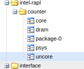
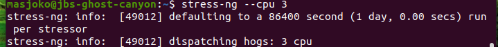
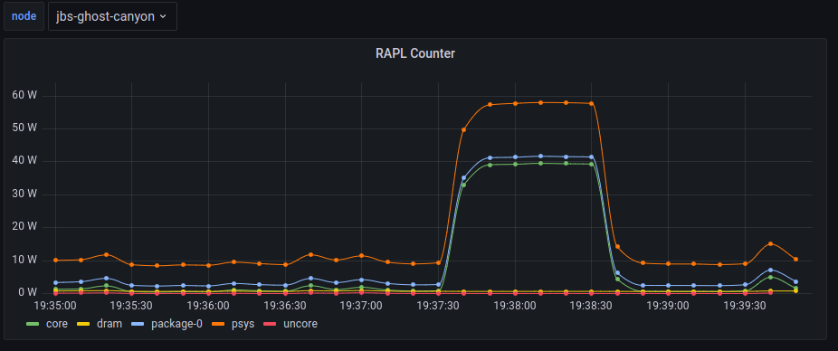

# Intel RAPL Collectd Plugin

## Quick start
### Infrastructure

Use `docker-compose.yml` to quickly instantiate Graphite and Grafana container set. You'll need to create docker volume named "grafana-volume" first before you call `docker-compose up -d`.

### Install collectd on you Linux machine

Please follow your respective favorite distro and for Ubuntu, for some version such as 20.04, we may need to add 
```
LD_PRELOAD=/usr/lib/python3.8/config-3.8-x86_64-linux-gnu/libpython3.8.so
```
in `/etc/default/collectd`

### Configure collectd to load intel_rapl.py and sending data to Graphite

Create a folder called `/usr/lib/collectd/python-plugins/` and copy `intel_rapl.py` into that folder.
```
sudo mkdir /usr/lib/collectd/python-plugins/
sudo cp intel_rapl.py /usr/lib/collectd/python-plugins/
```
Edit `/etc/collectd/collectd.conf` or collectd configuration of your distro to enable Python plugins and intel_rapl module and to activate write_graphite plugins
```
LoadPlugin python
LoadPlugin write_grapite

<Plugin python>
  ModulePath "/usr/lib/collectd/python-plugins/"
  LogTraces true
  Import "intel_rapl"
</Plugin>

<Plugin write_graphite>
  <Node "example">
    Host "replace_with_your_graphite_server"
    Port "2003"
    Protocol "tcp"
    ReconnectInterval 0
    Prefix "collectd."
    EscapeCharacter "_"
    SeparateInstances true
  </Node>
</Plugin>

```
Restart your collectd to get the data read and piped to Graphite.

You should see intel-rapl is shown on your node data.



You can also use Grafana to create your power dashboard.

## Seeing this baby in action

Let's run some stress testing on the platform under monitor, let say for 2 minutes.



We should be able to see some power spike recorded on Grafana dashboard.



On my Ghost Canyon NUC, the power peaked at 60 Watt.

## Some background information

Intel RAPL (Running Average Power Limit) provides mechanism to monitor energy usage of Intel platform. Under Linux platform, this data is exposed under powercap framework. Typically this data is located under:
```
/sys/devices/virtual/powercap/intel-rapl/
```

Under this folder we can find subfolder representing power domain with naming pattern "intel-rapl:m" and some of this folder contains another "intel-rapl:m:n".

Each of this intel-rapl folder contain several files describing monitoring attributes and constraints as explained by [Linux kernel documentation on powercap](https://www.kernel.org/doc/html/latest/power/powercap/powercap.html):
- energy_uj (rw) : Current energy counter in micro joules. Write “0” to reset. If the counter can not be reset, then this attribute is read only.
- max_energy_range_uj (ro) : Range of the above energy counter in micro-joules.
- power_uw (ro) : Current power in micro watts.
- max_power_range_uw (ro) : Range of the above power value in micro-watts.
- name (ro) : Name of this power zone.
- constraint_X_power_limit_uw (rw) : Power limit in micro watts, which should be applicable for the time window specified by “constraint_X_time_window_us”.
- constraint_X_time_window_us (rw) : Time window in micro seconds.
- constraint_X_name (ro) : An optional name of the constraint
- constraint_X_max_power_uw(ro) : Maximum allowed power in micro watts.
- constraint_X_min_power_uw(ro) : Minimum allowed power in micro watts.
- constraint_X_max_time_window_us(ro) : Maximum allowed time window in micro seconds.
- constraint_X_min_time_window_us(ro) : Minimum allowed time window in micro seconds.

Two key files (name and energy_uj) in intel-rapl domain is enough to monitor energy consumption on each power domain in an Intel platform. Depending on the generation, Intel platform may expose the following power domain:
- core
- uncore
- package-0
- psys
- dram

By reading those two files in every intel-rapl power domain, we could get great data.

